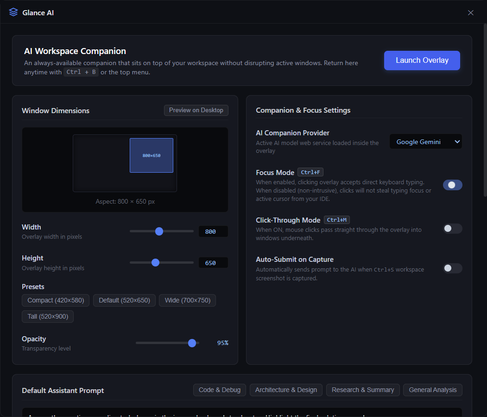

# Glance AI

Glance AI keeps Gemini, ChatGPT, Claude, or Perplexity in an always-on-top Windows overlay. It uses the provider's normal website and your existing account.

## Download

Get the installer or portable executable from [GitHub Releases](https://github.com/byohros6/glance-ai/releases). The installer adds Start menu and desktop shortcuts; the portable executable runs without installation. Windows is required.

Release assets include SHA-256 checksums and the source commit used for the build. See [download verification](docs/releasing.md). Current builds are unsigned, so Windows may show an unknown-publisher warning.

## Using Glance AI

From 1.2.9, Glance checks for newer published releases after startup and every 12 hours. An update prompt opens the matching installer or portable download. You can also use **Settings → App updates → Check for updates**. Download the new version, quit Glance, and run the installer in the same location or replace your portable executable. Settings are retained. Installation is manual; updates require a public repository and a published stable release.

Choose a provider in Settings and sign in through its normal interface. Glance AI keeps that interface, including the provider's conversation history and controls. Use the toolbar or shortcuts to capture, send, move, and adjust the overlay.



## Controls

| Shortcut | Action |
| --- | --- |
| Ctrl+S | Capture the **primary display** and attach it to the current AI conversation |
| Ctrl+Enter | Send the current message |
| Ctrl+B | Switch between the overlay and settings; the conversation stays loaded |
| Ctrl+F | Toggle direct typing; OFF makes the overlay non-activating |
| Ctrl+M | Toggle click-through; hover over the toolbar to use its controls |
| Ctrl+H | Hide/show the current window |
| Ctrl+Arrows | Move the overlay in 40px steps within a display work area |
| Ctrl+Shift+Up/Down | Scroll conversation history |
| Ctrl+[ / Ctrl+] | Adjust opacity between 15% and 100% |
| Ctrl+Shift+Q | Exit |

The existing shortcut defaults are retained. They are global and can intercept ordinary editing shortcuts in other apps. Rebind them in Settings if desired; conflicts and unavailable keys are reported. A successful rebind removes the old binding.

Capture hands the image to the selected provider's page. Its website may upload the image before you press Send. Auto-submit is optional and waits for an observed attachment preview. Existing draft text is preserved when adding the configured prompt. If an attachment or submission cannot be confirmed, check the conversation before retrying.

Settings opens independently of the provider view. Overlay focus and click-through preferences never disable the settings window. Changes save automatically after a short pause; Save Settings flushes immediately and reports write failures.

## Run and build

Windows with Node.js 22.12 or later is required; CI uses Node 24.

```sh
npm ci
npm start
npm run check
npm test
npm run test:smoke
npm run dist
```

`run.bat` launches the app. `build.bat` checks the repository, runs the tests, builds both executables, and prepares checksums. Commit changes first when preparing release assets. Outputs are under `dist/` and are intentionally not committed. Building does not publish a release. See the [release guide](docs/releasing.md) for the draft-release workflow.

The diagnostic focus bench is available with `npm run test-bench` or `open-test-bench.bat`.

## Reliability and security

- Remote provider pages have no application-control or screen-capture JavaScript bridge. Toolbar commands run in an isolated preload and reject synthetic page events.
- Main-process controls validate the exact window, main frame, and allowed URL. Authentication popups have a separate preload with no app capabilities; external protocols are restricted.
- Capture, attachment, prompt insertion, and optional submission form one bounded operation shared by the toolbar and shortcuts. Navigation cancels the operation.
- The primary-display capture fallback has a timeout. Window bounds recover when displays change.
- The local dashboard uses a Content Security Policy. Permission-sensitive website features ask before access.
- Windows capture exclusion is best-effort. It is not a guarantee of undetectability or protection against every capture method.

Provider interfaces can change. The automated suite uses local fixtures, including failure and delayed-upload scenarios; it does not claim to validate current authenticated sessions on all four live services. Unsupported page layouts produce an unconfirmed-result message rather than a false success.

## Project layout

- `src/main/`: application lifecycle, settings persistence, IPC authorization, window state, shortcuts, and capture operation coordination.
- `src/preload/preload.cjs`: single canonical preload; provider adapters and overlay toolbar. Only the local dashboard receives the settings bridge.
- `src/preload/auth.cjs`: capability-free authentication preload.
- `src/renderer/`: dashboard.
- `tests/`: unit, native-window, provider-fixture, production-entry integration, stress, and release-integrity tests.
- `tools/`: development diagnostics and repository/release checks.
- `docs/`: architecture, testing, release instructions, and screenshots.
- `.github/`: verification, draft releases, and contributor templates.

See [architecture](docs/architecture.md), [testing](docs/testing.md), [contributing](CONTRIBUTING.md), [security reporting](SECURITY.md), and the [changelog](CHANGELOG.md). MIT licensed; see [LICENSE](LICENSE).
